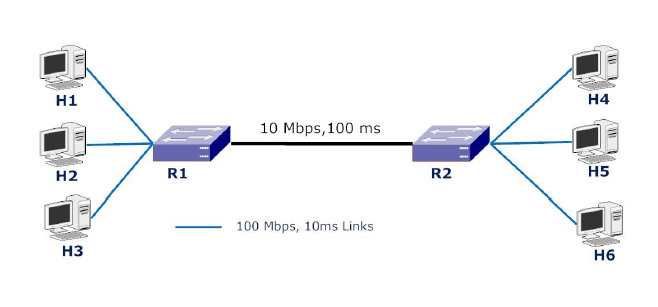

# Network Simulation using ns-3
The effect of buffer size on TCP and UDP flows was compared for the following topology:

All the hosts are attached to the routers with (100 Mbps, 10 ms) links. Both the routers (i.e. R1 and R2) use drop-tail queues with equal queue size set according to bandwidth-delay product.

A packet size of 1.5 KB was chosen. 4 TCP New Reno flows was initiated, and after a while 2 CBR over UDP flows each with 20 Mbps was started. These flows were randomly distributed across H1, H2 and H3. Then the rate of one UDP flow was increased up to 100 Mbps and its impact on the throughput of the TCP flows and the other UDP flow was observed. After that, the buffer size was varied in the range of 10 packets to 800 packets to find out the impact of buffer size on the fair share of bandwidth.